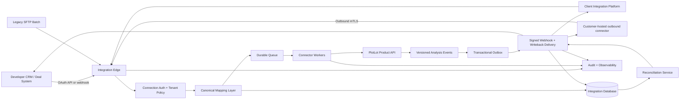

# PlotLot Real Estate Developer System Integration Playbook

- Date: 2026-08-03
- Status: Recommended target architecture and delivery runbook
- Audience: PlotLot product, engineering, data, security, operations, sales engineering, and implementation partners
- Assumption: PlotLot's core analysis product is already production-grade, multi-tenant, observable, and capable of producing versioned, evidence-backed results

## 1. Executive decision

PlotLot should use a **provider-neutral, API-first integration platform** rather than building a separate one-off integration for every customer.

The preferred connection order is:

1. **Direct API plus signed webhooks** when the developer's system exposes a supported public API.
2. **The client's existing integration platform** when their IT team has standardized on one.
3. **A customer-hosted outbound connector** when the target system is private or only reachable inside the customer's network.
4. **SFTP or scheduled file exchange** for legacy systems that cannot support modern APIs.
5. **Browser automation or direct database access only as temporary exceptions**, never as the default product architecture.

The PlotLot integration gateway may initially run on redundant Hetzner cloud servers, but it should be packaged as portable containers and provisioned with infrastructure-as-code. That allows the same gateway to move to another cloud or a customer-controlled environment when procurement, data residency, or compliance requires it.

The best first workflow is:

> When a site enters Feasibility Review in a developer's acquisitions system, submit the site to PlotLot, run an asynchronous analysis, return a compact decision summary and report link, route exceptions to a human reviewer, and write only the approved result back to the original deal.

## 2. Operating principle

PlotLot is the **system of intelligence** for parcel resolution, land-use evidence, site feasibility, development-capacity calculations, analysis versions, and reports.

The developer's acquisitions or deal-management platform remains the **system of record** for deal ownership, stage, assignments, approved business assumptions, and final investment decisions.

The integration layer is the **system of movement**. It authenticates, translates, queues, delivers, retries, reconciles, and audits information moving between the two systems.

No field should have uncontrolled ownership in both systems.

| Information | Authoritative system |
|---|---|
| Deal name, stage, owner, and status | Developer's deal system |
| Original site submission and client identifiers | Developer's deal system |
| Approved purchase price and approved underwriting assumptions | Developer's deal system |
| Resolved parcel, municipality, and zoning evidence | PlotLot |
| Development-capacity calculations | PlotLot |
| Analysis history, confidence, conflicts, and source citations | PlotLot |
| Final go/no-go decision | Developer's deal system |
| Detailed feasibility report | PlotLot |
| Final exported documents | PlotLot or the client's document repository |

## 3. All practical integration methods

The methods below cover the realistic ways PlotLot can connect to a developer's systems. A customer may use more than one method.

### 3.1 Manual PlotLot workspace with deep links

Users manually copy an address or parcel into PlotLot. PlotLot produces a report, and the user pastes a report link into the deal record.

**Best for:** demos, workflow discovery, and the first design-partner evaluation.

**Advantages:** almost no integration engineering, fast learning, low security exposure.

**Disadvantages:** duplicate entry, inconsistent adoption, no automatic status updates, weak operational measurement.

**Recommendation:** use before building a connector, but not as the final workflow.

### 3.2 Spreadsheet or CSV upload and download

The client exports candidate sites to a spreadsheet. PlotLot processes the batch and returns results in the same structure or provides a report manifest.

**Best for:** bulk screening, pilot validation, small developers, and systems without an API.

**Advantages:** simple, transparent, easy for analysts to inspect, good for golden-set testing.

**Disadvantages:** not real time, manual custody of files, duplicate and version risks, weak error handling.

**Recommendation:** mandatory fallback and excellent pilot method.

### 3.3 Scheduled SFTP file exchange

The customer deposits an encrypted CSV or JSON file in an SFTP location. PlotLot processes it and places results in an outbound folder.

**Best for:** legacy ERPs, nightly portfolio screening, and IT departments with established batch-transfer controls.

**Advantages:** predictable, firewall-friendly, auditable, widely accepted by traditional enterprises.

**Disadvantages:** delayed results, rigid schemas, file-level reconciliation, operational handling for partial failures.

**Recommendation:** supported legacy option, not the primary modern integration.

### 3.4 Email ingestion and delivery

Users forward a deal email or attachment to a controlled address. PlotLot extracts the site, runs the analysis, and replies with a report link.

**Best for:** low-volume early pilots and organizations whose current workflow is heavily email-based.

**Advantages:** minimal behavior change for users.

**Disadvantages:** unreliable identity, hard-to-validate inputs, sensitive attachments, threading problems, limited structured writeback.

**Recommendation:** convenience feature only. Do not use email as the authoritative system integration.

### 3.5 Direct REST or GraphQL API integration

The client's system or integration service calls PlotLot's public API using a service identity. PlotLot exposes job-status and report endpoints.

**Best for:** modern CRMs, deal-management platforms, custom internal applications, and scalable product integrations.

**Advantages:** structured contracts, strong authentication, real-time requests, versioning, observability, and good testability.

**Disadvantages:** requires engineering on one or both sides and careful lifecycle design.

**Recommendation:** primary inbound method.

### 3.6 Signed webhooks

PlotLot sends events such as `analysis.completed`, `analysis.needs_review`, and `analysis.failed` to a registered customer endpoint.

**Best for:** returning asynchronous results without repeated polling.

**Advantages:** fast delivery, low unnecessary traffic, clear event history.

**Disadvantages:** requires signature verification, retries, deduplication, replay protection, and a dead-letter process.

**Recommendation:** primary outbound method, paired with status polling as a fallback.

### 3.7 Integration platform as a service

An integration platform maps triggers and fields between PlotLot and the customer's applications.

**Best for:** clients that already operate an approved integration platform and want their IT team to own mappings.

**Advantages:** existing connectors, visual workflow management, credential governance, client familiarity, faster implementation.

**Disadvantages:** platform fees, vendor-specific behavior, limited control over complex recovery logic, another party in the support chain.

**Recommendation:** first-class compatibility option. PlotLot should publish a clean API and webhook contract that these platforms can consume.

### 3.8 Serverless integration functions

Small functions receive client events, map payloads, invoke PlotLot, and update the target system.

**Best for:** low-to-medium event volume, simple connectors, bursty workloads, and clients already standardized on a cloud provider.

**Advantages:** low idle cost, automatic scaling, limited server maintenance.

**Disadvantages:** execution limits, fragmented observability, cold starts, complex workflows spread across functions, provider lock-in.

**Recommendation:** good for thin adapters, not for the entire durable orchestration engine.

### 3.9 VPS-hosted integration gateway

A cloud server runs the connector API, workers, schedulers, and client adapters. Hetzner is one practical provider for this method.

**Best for:** early paying customers, predictable workloads, static outbound IP requirements, VPN termination, and teams comfortable operating Linux infrastructure.

**Advantages:** inexpensive, flexible, full network control, easy static IP allowlisting, portable containers.

**Disadvantages:** the PlotLot team owns patching, hardening, failover, backups, monitoring, scaling, and incident response.

**Recommendation:** viable hosting method when deployed redundantly. A single unmanaged VPS is not a production architecture.

### 3.10 Managed container or application platform

The gateway runs as containers or services on a platform that manages deployment, restarts, health checks, and scaling.

**Best for:** teams that want less server administration and do not require unusual private-network connectivity.

**Advantages:** easier deployments, managed health behavior, simpler scaling, reduced operating-system work.

**Disadvantages:** less network control, potential static-egress complications, platform limits, higher cost than a basic VPS.

**Recommendation:** strong default when customer connectivity requirements fit the platform.

### 3.11 Customer-hosted outbound connector

PlotLot supplies a small signed container or service that the customer runs inside its environment. The connector opens an outbound mutually authenticated connection, receives work, calls the internal system, and returns results.

**Best for:** private APIs, on-premises systems, strict enterprise firewalls, and clients unwilling to allow inbound network access.

**Advantages:** no inbound customer firewall opening, client-controlled reach, least-privilege access, easy customer revocation.

**Disadvantages:** version distribution, health monitoring, customer deployment coordination, support across multiple environments.

**Recommendation:** preferred private-system pattern.

### 3.12 Site-to-site VPN or private tunnel

The PlotLot gateway and customer network establish WireGuard, IPsec, or another approved private tunnel.

**Best for:** a stable private API with a cooperative customer network team.

**Advantages:** direct private connectivity and familiar enterprise network controls.

**Disadvantages:** routing conflicts, tunnel monitoring, certificate or key rotation, broader network risk, slow client approvals.

**Recommendation:** use when the customer requires it. Restrict routes to the smallest possible address and port set.

### 3.13 Zero-trust application access or reverse tunnel

A customer-side component publishes only the required internal application through an identity-aware tunnel.

**Best for:** clients already using a zero-trust access provider.

**Advantages:** application-level access, outbound connection from the client, identity-aware policy.

**Disadvantages:** dependency on the client's zero-trust vendor and configuration maturity.

**Recommendation:** good alternative to a traditional VPN.

### 3.14 Enterprise message bus or event streaming

PlotLot produces and consumes messages through the customer's event bus or a mutually accessible broker.

**Best for:** large organizations with event-driven architecture and strict decoupling requirements.

**Advantages:** durable asynchronous delivery, replay, high throughput, strong internal integration patterns.

**Disadvantages:** substantial onboarding, schema governance, broker access, operational complexity.

**Recommendation:** enterprise option, not the first design-partner implementation.

### 3.15 Direct database integration

PlotLot reads from or writes to customer database tables, views, replicas, or stored procedures.

**Best for:** rare legacy environments where the customer explicitly provides a governed integration schema and no application API exists.

**Advantages:** potentially efficient bulk access.

**Disadvantages:** tight coupling, schema-change risk, large security blast radius, difficult auditing, accidental data corruption, bypassed business rules.

**Recommendation:** avoid direct writes. If unavoidable, use a customer-owned read-only integration view and write results through a separate staging schema controlled by the customer.

### 3.16 Change-data capture

The customer streams database changes into an event system, and PlotLot consumes selected events.

**Best for:** mature enterprise data platforms that already operate change-data-capture infrastructure.

**Advantages:** low-latency updates without polling source tables.

**Disadvantages:** raw database semantics leak into integrations, deletions and schema changes are complex, writeback still needs a safe path.

**Recommendation:** consume only curated events, not unrestricted database logs.

### 3.17 Browser automation or robotic process automation

A controlled browser logs into a system, reads a deal, submits information, or updates fields.

**Best for:** temporary bridging when no API, file export, or approved database interface exists.

**Advantages:** can automate otherwise closed applications.

**Disadvantages:** fragile selectors, MFA problems, credential risk, UI changes, poor concurrency, difficult error recovery.

**Recommendation:** last resort with an explicit retirement date.

### 3.18 Embedded PlotLot interface or marketplace application

PlotLot appears as an embedded panel, extension, or marketplace application inside the developer's system. The embedded UI passes the current deal identity to PlotLot and displays status and report summaries.

**Best for:** high-adoption workflows and widely used target platforms.

**Advantages:** users remain in their familiar system, strong context, improved adoption.

**Disadvantages:** platform-specific UI work, review requirements, browser security constraints, still requires a backend API integration.

**Recommendation:** build after the underlying API connector is proven.

### 3.19 Data warehouse, lake, or reverse-ETL integration

PlotLot exports normalized analysis events and results into the client's analytics environment. A reverse-ETL tool may later push selected aggregates into operational systems.

**Best for:** portfolio analytics, model monitoring, market coverage reporting, and executive dashboards.

**Advantages:** separates analytics from transactional workflows and supports historical analysis.

**Disadvantages:** not suitable for immediate operational writeback and can create stale copies of trust-critical fields.

**Recommendation:** secondary analytics channel after operational integration works.

### 3.20 Agent and MCP access

An approved agent can invoke PlotLot tools through a governed agent interoperability boundary.

**Best for:** analyst copilots and controlled automation inside an existing agent platform.

**Advantages:** natural-language workflows and reusable tool contracts.

**Disadvantages:** agent unpredictability, approval requirements, and unsuitability as the sole record-sync mechanism.

**Recommendation:** supplemental reasoning interface. Use the product API and event system for authoritative integration state.

## 4. Decision matrix

Ratings are relative: 5 is strongest or easiest, and 1 is weakest or hardest.

| Method | Initial speed | Reliability | Security control | Scales across clients | Best use | PlotLot position |
|---|---:|---:|---:|---:|---|---|
| Manual deep link | 5 | 2 | 4 | 1 | Discovery | Pilot only |
| CSV/spreadsheet | 5 | 3 | 3 | 3 | Batch pilot | Supported fallback |
| SFTP | 3 | 4 | 4 | 3 | Legacy batch | Supported fallback |
| Email | 4 | 1 | 2 | 1 | Convenience | Non-authoritative |
| Direct API | 3 | 5 | 5 | 5 | Modern systems | Primary |
| Signed webhooks | 3 | 5 | 5 | 5 | Async results | Primary |
| Integration platform | 4 | 4 | 4 | 4 | Client-standard tooling | Preferred option |
| Serverless adapter | 4 | 4 | 4 | 3 | Thin mapping | Useful adapter |
| VPS gateway | 4 | 4 when redundant | 4 | 4 | Controlled middleware | Viable host |
| Managed container platform | 4 | 5 | 4 | 5 | Shared gateway | Strong host |
| Customer-hosted connector | 2 | 4 | 5 | 4 | Private systems | Primary private pattern |
| VPN/private tunnel | 2 | 4 | 4 | 2 | Private API | Customer-dependent |
| Message bus | 1 | 5 | 5 | 4 | Large enterprise | Enterprise option |
| Direct database | 3 | 2 | 1 | 1 | Exceptional legacy | Avoid |
| Change-data capture | 1 | 4 | 3 | 2 | Mature data platform | Curated events only |
| Browser automation | 3 | 1 | 2 | 1 | Closed legacy UI | Temporary exception |
| Embedded app | 2 | 4 | 4 | 3 | User adoption | Build after API |
| Warehouse export | 3 | 4 | 4 | 5 | Analytics | Secondary channel |
| MCP/agent tools | 3 | 3 | 3 | 4 | Copilot workflows | Supplemental |

## 5. Recommended target architecture



### 5.1 Core services

1. **Integration edge:** receives authenticated requests and client webhooks.
2. **Connection service:** stores client connection metadata, scopes, status, and secret references.
3. **Canonical mapping layer:** translates every provider-specific payload into one PlotLot integration model.
4. **Durable queue:** separates request acceptance from long-running work.
5. **Connector workers:** call client and PlotLot APIs with rate-limit and retry handling.
6. **Integration database:** stores external-ID mappings, idempotency keys, jobs, delivery attempts, and reconciliation state.
7. **Transactional outbox:** ensures a committed result produces a durable delivery event.
8. **Webhook delivery service:** signs, delivers, retries, and dead-letters events.
9. **Reconciliation service:** finds completed analyses that were not reflected in the client system.
10. **Audit and observability:** records who, what, when, connection, external record, payload version, result, and correlation ID.
11. **Customer connector manager:** registers, upgrades, and monitors outbound customer-hosted agents.

### 5.2 Hosting recommendation

For the first paying integrations, PlotLot can run the gateway on Hetzner using:

- a load balancer;
- at least two stateless gateway or worker instances;
- a private network between application components;
- a database and durable queue separated from the application nodes;
- restricted cloud firewalls;
- a stable outbound address for customer allowlisting;
- encrypted, independently stored backups;
- external uptime, log, and security monitoring;
- a documented second-region restoration or failover process.

Hetzner documents stateful firewalls with implicit inbound deny, private Layer 3 networks, and load balancers with active and passive health checks:

- <https://docs.hetzner.com/cloud/firewalls/faq/>
- <https://docs.hetzner.com/networking/networks/faq/>
- <https://docs.hetzner.com/networking/load-balancers/faq/>

Hetzner's published Cloud Server SLA targets 99.9% monthly availability for each Cloud Server, while additional services such as firewalls, load balancers, and backups are outside that server SLA. The platform therefore still requires PlotLot-owned redundancy, recovery, and monitoring:

- <https://docs.hetzner.com/general/company-and-policy/slas-cloud/>

Hetzner also states that customers are responsible for managing, maintaining, and securing unmanaged cloud servers:

- <https://docs.hetzner.com/general/security-and-identify/technical-and-organizational-measures/>

The gateway must remain deployable elsewhere. If an enterprise customer requires its approved cloud, private account, region, or compliance package, deploy the same containerized gateway without changing the PlotLot integration contract.

## 6. Canonical integration contract

### 6.1 Inbound analysis request

```http
POST /v1/integration/analyses
Authorization: Bearer <service-credential>
Idempotency-Key: client-123:deal-4821:site-719:feasibility:request-1
X-Correlation-ID: client-request-8821
Content-Type: application/json
```

```json
{
  "connection_id": "conn_01JXYZ",
  "source_system": "developer_crm",
  "external_deal_id": "DEAL-4821",
  "external_site_id": "SITE-719",
  "external_record_url": "https://client.example/deals/4821",
  "analysis_type": "site_feasibility",
  "site": {
    "address": "125 Main Street, Fort Lauderdale, FL",
    "parcel_id": "5042-00-00-1230"
  },
  "project": {
    "name": "Main Street Apartments",
    "market": "South Florida",
    "product_type": "multifamily"
  },
  "assumptions": {
    "purchase_price": 2100000,
    "target_unit_size_sqft": 850,
    "construction_cost_psf": 235
  },
  "requested_by": {
    "external_user_id": "USER-92"
  }
}
```

### 6.2 Immediate acceptance response

```http
HTTP/1.1 202 Accepted
```

```json
{
  "analysis_id": "ana_01JXYZ",
  "status": "queued",
  "external_deal_id": "DEAL-4821",
  "external_site_id": "SITE-719",
  "status_url": "https://api.plotlot.example/v1/integration/analyses/ana_01JXYZ"
}
```

The integration request must not remain open while the analysis runs.

### 6.3 Completion event

```json
{
  "event_id": "evt_98341",
  "event_type": "analysis.needs_review",
  "occurred_at": "2026-08-03T15:22:41Z",
  "connection_id": "conn_01JXYZ",
  "workspace_id": "ws_10",
  "analysis_id": "ana_01JXYZ",
  "analysis_version": 1,
  "external_deal_id": "DEAL-4821",
  "external_site_id": "SITE-719",
  "status": "needs_review",
  "summary": {
    "parcel_id": "5042-00-00-1230",
    "municipality": "Fort Lauderdale",
    "zoning_district": "RM-15",
    "max_units": 31,
    "governing_constraint": "density",
    "confidence": "medium",
    "critical_warning": "Parking requirement requires confirmation"
  },
  "report_url": "https://app.plotlot.example/reports/rpt_2821"
}
```

### 6.4 Required event headers

```text
X-PlotLot-Event-ID
X-PlotLot-Timestamp
X-PlotLot-Signature
X-PlotLot-Key-ID
X-Correlation-ID
```

The receiver must verify the signature, reject expired timestamps, and deduplicate by event ID.

### 6.5 Stable identity

Addresses are mutable inputs, not durable identifiers. The primary integration identity is:

```text
client organization
+ connection
+ source system
+ external deal ID
+ external site ID
+ analysis type
```

PlotLot should maintain this mapping:

```text
Client deal DEAL-4821
    -> PlotLot workspace WS-10
    -> Project PRJ-44
    -> Site SITE-88
    -> Analysis ANA-103
    -> Approved run RUN-109 version 3
```

## 7. Step-by-step implementation route

## Stage A: Build the reusable PlotLot integration foundation

### Step 1: Freeze the system-of-record rules

Document which fields PlotLot owns and which fields the client owns. Reject any design where the same critical field can be changed independently by both systems without a conflict policy.

**Exit gate:** signed field-ownership matrix.

### Step 2: Define the canonical integration model

Create provider-neutral objects for:

- organization;
- connection;
- external record;
- project;
- site;
- analysis request;
- analysis run;
- report version;
- delivery event;
- delivery attempt;
- review task;
- reconciliation finding.

Provider-specific fields belong in adapter metadata, not the canonical core.

**Exit gate:** versioned schema and example payloads.

### Step 3: Implement tenant and connection isolation

Every integration record must include an organization and connection. Authorization must verify membership or service-account scope before reading or mutating any workspace, site, analysis, report, credential, or event.

**Exit gate:** automated cross-tenant access tests pass.

### Step 4: Implement service-to-service authentication

Support scoped service credentials or OAuth client credentials. Human session tokens are not appropriate for unattended connectors.

Required capabilities include:

- credential issuance;
- secret hashing or secure reference storage;
- scopes;
- expiration;
- rotation;
- revocation;
- last-used metadata;
- audit history.

**Exit gate:** a revoked credential cannot submit, read, or receive integration data.

### Step 5: Implement asynchronous job submission

The public endpoint validates and persists the request, enforces idempotency, enqueues work, and returns `202 Accepted` immediately.

**Exit gate:** repeated requests with the same idempotency key return the same job.

### Step 6: Implement durable execution state

Use explicit states:

```text
received -> validated -> queued -> running -> quality_check
-> completed | needs_review | unsupported | failed | cancelled
```

Every state transition records an event and timestamp.

**Exit gate:** an operator can reconstruct the full lifecycle without reading application logs.

### Step 7: Implement the transactional outbox

When PlotLot commits a terminal analysis state, commit a matching outbound event in the same transaction. A separate delivery worker publishes it.

This avoids the failure where an analysis is committed but its webhook is lost.

**Exit gate:** forced worker failure does not lose a committed completion event.

### Step 8: Implement webhook delivery

Provide:

- HMAC or asymmetric signatures;
- timestamp validation;
- key rotation;
- exponential retries;
- attempt history;
- endpoint disablement after repeated permanent failures;
- dead-letter storage;
- authorized manual replay;
- polling fallback.

Example retry schedule:

```text
1 minute -> 5 minutes -> 15 minutes -> 1 hour
-> 4 hours -> 12 hours -> 24 hours
```

**Exit gate:** a simulated 24-hour client outage recovers without duplicate business updates.

### Step 9: Implement the adapter framework

Each adapter implements the same operations:

```text
authorize
verify_connection
receive_trigger
read_external_record
map_to_plotlot
write_status
write_summary
attach_report_link
create_review_task
reconcile_record
revoke
```

**Exit gate:** a test adapter passes the shared connector contract suite.

### Step 10: Implement reconciliation

Run a scheduled comparison between terminal PlotLot analyses and confirmed client writebacks.

Find:

- completed analysis with no successful delivery;
- successful delivery with missing client record;
- stale PlotLot version in the client system;
- client record updated by an older out-of-order event;
- orphaned external mapping;
- disabled or expired connection.

**Exit gate:** every mismatch becomes a replay, a repair job, or an assigned incident.

### Step 11: Implement observability and audit

Track:

- correlation ID;
- organization and connection;
- external deal and site IDs;
- job state and age;
- adapter and endpoint;
- request and response status;
- retry count;
- delivery latency;
- rate-limit state;
- final disposition.

Redact tokens, passwords, raw secrets, and unnecessary personal information.

**Exit gate:** support can trace one client deal from trigger through approved writeback.

### Step 12: Package a customer-hosted connector

Create a signed, minimal container that:

- initiates outbound mTLS only;
- receives only jobs for its connection;
- calls an allowlisted internal destination;
- stores no durable customer data locally;
- exposes health and version information;
- supports automatic or controlled upgrades;
- can be revoked immediately.

**Exit gate:** the connector works without any inbound customer firewall rule.

## Stage B: Onboard the first design partner

### Step 13: Select one workflow

Choose one trigger, such as:

> Deal stage changes to Feasibility Review.

Limit the pilot to one market, one analysis type, one client system, and three to five users.

**Exit gate:** one-sentence workflow scope approved by both product owners.

### Step 14: Map the current human process

Interview acquisitions analysts and document:

1. where sites originate;
2. who enters them;
3. where parcel IDs live;
4. which assumptions are required;
5. who verifies zoning;
6. who approves the analysis;
7. where reports are stored;
8. what happens when evidence conflicts;
9. how much time the current process consumes;
10. what decision the result supports.

**Exit gate:** current-state process map and baseline metrics.

### Step 15: Inventory the client system

Collect:

- API and webhook documentation;
- sandbox availability;
- authentication method;
- rate limits;
- field and object limits;
- custom-field support;
- document-link support;
- SSO provider;
- network restrictions;
- existing integration platform;
- data residency and retention requirements;
- security-review process;
- vendor approval requirements.

**Exit gate:** completed technical discovery worksheet.

### Step 16: Choose the connection method

Use this decision tree:

```text
Does the target expose an approved public API?
  Yes -> Direct API + signed PlotLot webhooks
  No  -> Does the client have an approved integration platform?
           Yes -> Connect that platform to PlotLot API/webhooks
           No  -> Is the target reachable from a customer-hosted connector?
                    Yes -> Outbound customer connector
                    No  -> Can IT approve a narrow VPN or zero-trust tunnel?
                             Yes -> Private API connector
                             No  -> SFTP/CSV batch fallback

If none work -> temporary RPA with an agreed retirement plan
```

**Exit gate:** connection decision and fallback documented.

### Step 17: Agree on success measures

Recommended pilot gates:

- 100% correct external deal and site matching;
- zero duplicate analyses from retries;
- zero lost terminal events;
- 100% source links on trust-critical zoning claims;
- explicit quality threshold for supported-market critical fields;
- agreed analysis completion target;
- measurable analyst time reduction;
- zero cross-tenant exposure;
- every low-confidence or conflicting result routed to review.

**Exit gate:** written acceptance matrix.

### Step 18: Complete security and data review

Agree on:

- data inventory and classification;
- minimum fields transferred;
- subprocessors and hosting region;
- encryption;
- credential custody;
- retention and deletion;
- incident notification;
- audit access;
- backup policy;
- recovery expectations;
- SSO or human-access model;
- penetration and vulnerability evidence;
- connection termination process.

**Exit gate:** security approval for sandbox data.

### Step 19: Create sandbox resources

Create:

- client organization;
- sandbox workspace;
- connection record;
- service account;
- scoped sandbox credential;
- webhook signing key;
- registered endpoints;
- test users and roles;
- sample external mappings;
- client-specific quotas.

**Exit gate:** connectivity test passes in both directions.

## Stage C: Build the client adapter

### Step 20: Create the client trigger

Prefer a deliberate `Analyze with PlotLot` action for the first rollout. Later, automate based on deal stage if users trust the workflow.

The trigger must include a stable external deal ID and external site ID.

**Exit gate:** one test deal produces one PlotLot request.

### Step 21: Implement inbound mapping

Map the client's objects and fields into the canonical PlotLot request. Validate required values before submission and return actionable field-level errors.

Do not transmit unrelated contacts, notes, documents, or financial information.

**Exit gate:** mapping tests cover missing, malformed, optional, and extra fields.

### Step 22: Implement status writeback

Immediately write the PlotLot analysis ID and status to clearly labeled fields:

```text
PlotLot Analysis ID
PlotLot Status
PlotLot Submitted At
PlotLot Last Updated
PlotLot Version
PlotLot Report
PlotLot Review Required
```

**Exit gate:** users can see that the request was accepted without leaving the deal record.

### Step 23: Implement result mapping

Write only the agreed decision summary:

- confirmed parcel;
- municipality;
- zoning district;
- maximum units;
- governing constraint;
- FAR;
- height;
- lot coverage;
- setbacks;
- confidence;
- review status;
- critical warning;
- report link;
- analysis version and completion time.

Detailed sources, calculations, and scenarios remain in PlotLot.

**Exit gate:** writeback does not overwrite any client-owned field.

### Step 24: Implement human review

If PlotLot reports a parcel conflict, missing official source, unverified overlay, low confidence, or material assumption conflict, create a review task for the assigned analyst.

An override records:

- previous value;
- approved value;
- reason;
- supporting evidence;
- user;
- timestamp;
- resulting report version.

**Exit gate:** unreviewed exceptions cannot appear as approved results.

### Step 25: Implement approved-result writeback

During the initial rollout, write preliminary values to preview fields. Update official client-facing PlotLot result fields only when the report version is approved.

Use conditional version checks so an older event cannot overwrite a newer result.

**Exit gate:** out-of-order event test preserves the newest approved version.

## Stage D: Test the complete system

### Step 26: Build the golden parcel set

Use 50 to 100 jointly reviewed sites containing:

- normal parcels;
- malformed addresses;
- missing parcel IDs;
- duplicate addresses;
- assemblages;
- split-zoned parcels;
- overlays;
- conditional uses;
- unsupported municipalities;
- previously completed projects;
- sites the client rejected;
- sites the client acquired.

**Exit gate:** the client's experienced analyst signs off expected outcomes or acceptable ranges.

### Step 27: Run contract and mapping tests

Verify API versions, required fields, enum handling, authentication, signatures, idempotency, pagination, rate limits, and error payloads.

**Exit gate:** both parties' sandbox contract suites pass.

### Step 28: Run lifecycle and failure tests

Test:

- successful completion;
- `needs_review`;
- unsupported market;
- parcel conflict;
- cancellation;
- duplicate submission;
- expired credentials;
- token rotation;
- client API timeout;
- client rate limiting;
- PlotLot worker restart;
- webhook outage;
- webhook replay;
- out-of-order events;
- dead-letter replay;
- database restoration;
- second-region recovery.

**Exit gate:** no terminal analysis is silently lost.

### Step 29: Run security tests

Verify:

- cross-workspace isolation;
- least-privilege scopes;
- signature validation;
- replay protection;
- secret redaction;
- encryption;
- administrator access controls;
- connector revocation;
- customer data deletion;
- audit completeness;
- dependency and image vulnerability scanning.

**Exit gate:** no unresolved critical or high-severity finding.

### Step 30: Run performance and volume tests

Test expected daily volume, realistic bursts, target-system rate limits, queue aging, worker scaling, and reconciliation duration.

**Exit gate:** agreed throughput and completion targets pass with headroom.

### Step 31: Run user acceptance testing

Pilot users confirm:

- the trigger is understandable;
- fields populate correctly;
- status is visible;
- report links open through approved authentication;
- review tasks reach the right person;
- evidence is understandable;
- corrections are traceable;
- failures explain what to do next;
- the workflow saves meaningful time.

**Exit gate:** business owner approves a controlled production pilot.

## Stage E: Roll out safely

### Step 32: Run shadow mode

For one to two weeks, process real deals without updating official result fields. Compare PlotLot with the existing manual analysis and investigate material differences.

**Exit gate:** quality and time-saving thresholds pass.

### Step 33: Run approved-only writeback

Automatically submit sites, require analysts to review every result, and write back only approved report versions.

**Exit gate:** no unresolved incorrect writeback during the agreed pilot window.

### Step 34: Enable conditional automation

Auto-write results only when client-approved conditions are satisfied, such as:

- supported jurisdiction;
- parcel identity confirmed;
- required authoritative sources present;
- no unresolved evidence conflicts;
- confidence at or above threshold;
- no material assumption warning.

Everything else remains human-reviewed.

**Exit gate:** sampled automated results maintain the agreed quality threshold.

### Step 35: Expand gradually

Expand in this order:

1. more users in the same workflow;
2. more projects in the same market;
3. more supported markets;
4. batch screening;
5. more analysis types;
6. document-repository integration;
7. analytics export;
8. construction or ERP integration only when a specific business workflow justifies it.

## Stage F: Operate continuously

### Step 36: Monitor service and business metrics

Technical metrics:

- accepted and rejected requests;
- queue depth and oldest-job age;
- completion and failure rate;
- analysis latency percentiles;
- connector API errors;
- client rate limiting;
- webhook success and latency;
- retry and dead-letter volume;
- reconciliation mismatches;
- credential age and expiry;
- agent health and version.

Business and quality metrics:

- parcel-resolution rate;
- needs-review rate;
- human override rate;
- critical-field agreement rate;
- time saved per site;
- analyses per active user;
- go/no-go decision time;
- supported-market success rate;
- cost per analysis.

### Step 37: Establish support ownership

| Issue | Primary owner |
|---|---|
| PlotLot analysis failure | PlotLot engineering |
| Incorrect parcel or zoning result | PlotLot data-quality team |
| Client API unavailable | Client IT |
| Field mapping error | Integration engineering |
| User workflow problem | Joint product owners |
| Security incident | Both security teams |
| Incorrect client assumptions | Client business owner |
| Customer connector unavailable | Client IT with PlotLot integration support |

### Step 38: Manage schema and API versions

Use additive changes when possible. Publish changelogs, contract tests, deprecation dates, and migration instructions. Keep old versions for a documented transition period and measure remaining usage before removal.

### Step 39: Reanalyze when evidence changes

When authoritative source material changes, identify affected analyses, create new analysis versions, and notify the client. Never silently mutate an approved historical report.

### Step 40: Review every connection regularly

At least quarterly:

- confirm business owner;
- review scopes;
- rotate or validate credentials;
- verify webhook destinations;
- remove unused fields;
- test connector health;
- test restore and replay;
- review retention;
- confirm active users;
- examine error and override trends.

## 8. Team and ownership

### PlotLot core team

| Role | Responsibility |
|---|---|
| Product and integration lead | Partner scope, workflow, field ownership, acceptance, roadmap |
| Backend/integration engineer | API, queue, adapter framework, webhooks, reconciliation |
| Platform/DevOps engineer | Environments, deployment, networking, secrets, monitoring, recovery |
| Data/GIS engineer | Parcel matching, coverage, source freshness, quality monitoring |
| Real-estate SME | Golden set, zoning and underwriting review, acceptance |
| Security lead | Threat model, controls, customer security review, incident process |
| QA engineer | Contract, failure, security, performance, and UAT coordination |

### Customer team

| Role | Responsibility |
|---|---|
| Business owner | Workflow and outcome approval |
| Acquisitions lead | Field meanings, user process, quality acceptance |
| System administrator | Sandbox, custom fields, credentials, deployment |
| Integration or IT engineer | API, platform, VPN, agent, monitoring |
| Security/privacy reviewer | Data, access, vendor, and incident approval |
| Pilot users | Real-world UAT and feedback |

## 9. Suggested 12-week first integration

| Week | Deliverable |
|---|---|
| 1 | Workflow discovery, baseline metrics, and one-sentence scope |
| 2 | System inventory, field ownership, and connection decision |
| 3 | Canonical mapping, API/webhook contract, and security design |
| 4 | Sandbox workspace, service identity, credentials, and connectivity |
| 5 | Trigger and inbound mapping |
| 6 | Status, result, report-link, and review-task writeback |
| 7 | Golden parcel set and contract tests |
| 8 | Failure, security, volume, and recovery tests |
| 9 | User acceptance testing |
| 10 | Shadow-mode production pilot |
| 11 | Approved-only writeback |
| 12 | Conditional automation and launch review |

Customer procurement, security review, legacy vendor coordination, or private-network approval may extend the calendar without changing the technical sequence.

## 10. Non-negotiable production gates

Do not authorize broad production rollout until all are true:

- every request carries a stable external identity;
- retries are idempotent;
- terminal events are durable;
- webhook delivery is signed, retried, and replayable;
- reconciliation detects missing writebacks;
- tenant isolation is proven;
- service credentials are scoped, rotatable, and revocable;
- low-confidence and conflicting results require review;
- approved reports are immutable and versioned;
- client-owned fields cannot be overwritten by PlotLot;
- backups are independent and restoration has been tested;
- customer data deletion has been tested;
- monitoring and incident ownership are active;
- the client has accepted quality against real parcels;
- the workflow demonstrably reduces analyst effort or decision time.

## 11. Anti-patterns to avoid

1. One VPS containing the gateway, production database, queue, secrets, and only backup.
2. One shared API key for every customer.
3. Using a human login token for automated integrations.
4. Using the property address as the primary external identity.
5. Keeping a request open while analysis runs.
6. Treating webhook delivery as exactly-once without idempotency.
7. Writing every PlotLot field into the CRM.
8. Allowing PlotLot to overwrite client-approved assumptions.
9. Connecting directly to a customer's production database by default.
10. Opening the customer's network broadly to a PlotLot VPS.
11. Deploying a customer connector that accepts inbound public traffic.
12. Using browser automation without a retirement date.
13. Marking incomplete evidence as a completed analysis.
14. Silently mutating approved reports when sources change.
15. Building a platform-specific embedded UI before proving the backend connector.
16. Adding more client systems before the first workflow is stable and measured.

## 12. Final recommendation

Build one reusable integration platform and allow multiple transports around it.

The default production path is:

```text
Developer system trigger
-> Direct API or client integration platform
-> PlotLot integration gateway
-> Canonical mapping and idempotent job
-> Durable queue
-> PlotLot analysis
-> Quality gate
-> Versioned report and transactional outbox
-> Signed webhook
-> Client writeback
-> Human review when needed
-> Approved result
-> Continuous reconciliation and monitoring
```

Use a redundant Hetzner-hosted gateway for the early commercial stage if the team is prepared to operate it. Keep the gateway portable. For private customer systems, prefer a customer-hosted outbound connector over inbound access or a broad VPN. Maintain SFTP/CSV as a supported legacy fallback. Treat direct database access and browser automation as temporary, tightly controlled exceptions.

This route gives PlotLot the best balance of speed, security, customer acceptance, reliability, and long-term scalability.
